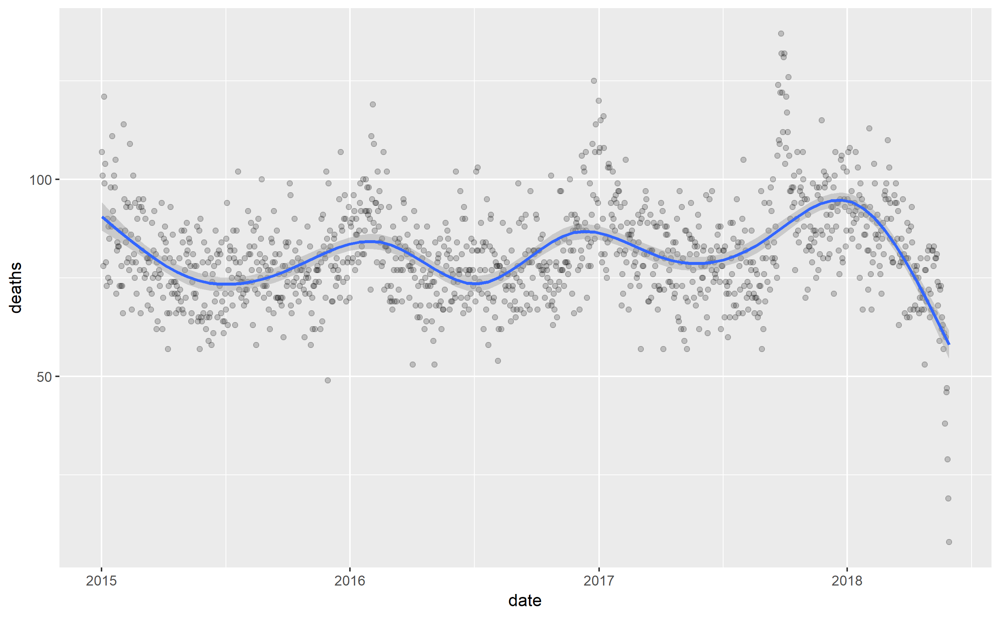

```{r setup, include=FALSE}
knitr::opts_chunk$set(echo = TRUE)
```

## Introduction

This is a report on deaths from 2015 until May 31, 2018 obtained from the pdf titled RD-Mortality-Report_2015-18-180531.pdf from the dslabs library. This is loosely based on the exercises from [the string processing chapter of Rafael A. Irizarry's Introduction to Data Science](https://rafalab.github.io/dsbook/string-processing.html)


## Deaths by date

We note the seasonality with a peak around the new year by generating a smoothed plot of deaths by date:


